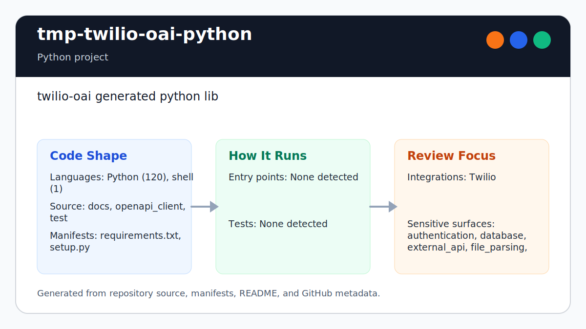

# tmp-twilio-oai-python

<!-- README-OVERVIEW-IMAGE -->


## Overview

`garethpaul/tmp-twilio-oai-python` is a Python project. twilio-oai generated python lib

This README is based on the checked-in source, manifests, scripts, and repository metadata on the `master` branch. The project language mix found during review was: Python (120), shell (1).

## Repository Contents

- `README.md` - project overview and local usage notes
- `CHANGES.md` - maintenance history for generated-client checks
- `Makefile` - local verification entry points
- `requirements.txt` - Python dependency or packaging metadata
- `docs` - source or example code
- `docs/plans` - completed maintenance plans for the current baseline
- `openapi_client` - source or example code
- `plans` - historical implementation notes
- `scripts` - documentation-plan validators
- `SECURITY.md` - security reporting and disclosure guidance
- `setup.py` - Python dependency or packaging metadata
- `test` - source or example code
- `VISION.md` - project direction and maintenance guardrails

Additional scan context:

- Source directories: docs, openapi_client, test
- Dependency and build manifests: requirements.txt, setup.py
- Entry points or build surfaces: none detected
- Test-looking files: test/test_auth_configuration.py, test/test_configuration_defaults.py, generated tests under test/

## Getting Started

### Prerequisites

- Git
- Python 3.6 or newer

### Setup

```bash
git clone https://github.com/garethpaul/tmp-twilio-oai-python.git
cd tmp-twilio-oai-python
python -m pip install -r requirements.txt
```

The setup commands above are derived from repository files. Legacy mobile, Python, or JavaScript samples may require older SDKs or package versions than a modern workstation uses by default.

## Running or Using the Project

- Import `openapi_client.Configuration` and provide Twilio credentials through
  the generated basic-auth configuration. The default API host is
  `https://api.twilio.com`.

## Testing and Verification

- `make check` runs Python syntax checks, the generated pytest suite, and
  `setup.py check`.
- The pytest suite includes no-network checks for default host configuration
  and runtime-only Basic auth headers.
- `make check` also requires completed canonical plans under `docs/plans`.

When the required SDK or runtime is unavailable, use static checks and source review first, then verify on a machine that has the matching platform toolchain.

## Configuration and Secrets

- Detected references to Twilio. Keep API keys, OAuth credentials, tokens, and account-specific values in local configuration only.

## Security and Privacy Notes

- Review changes touching authentication or token handling; examples from the scan include docs/ApiV2010AccountToken.md, docs/DefaultApi.md, openapi_client/api/default_api.py, openapi_client/api_client.py, and 2 more.
- Review changes touching external API calls or credential-adjacent configuration; examples from the scan include docs/DefaultApi.md, openapi_client/__init__.py, openapi_client/api/default_api.py, openapi_client/api_client.py, and 6 more.
- Review changes touching network requests, sockets, or service endpoints; examples from the scan include .gitlab-ci.yml, .travis.yml, docs/DefaultApi.md, git_push.sh, and 6 more.
- Review changes touching file, media, JSON, XML, CSV, OCR, or data parsing; examples from the scan include .gitlab-ci.yml, docs/DefaultApi.md, openapi_client/api/default_api.py, openapi_client/api_client.py, and 6 more.
- Review changes touching database, model, or persistence code; examples from the scan include docs/ApiV2010Account.md, docs/ApiV2010AccountAddress.md, docs/ApiV2010AccountAddressDependentPhoneNumber.md, docs/ApiV2010AccountApplication.md, and 6 more.
- Review changes touching infrastructure, proxy, cloud, or deployment configuration; examples from the scan include docs/DefaultApi.md, openapi_client/api/default_api.py.

## Maintenance Notes

- See `SECURITY.md` for vulnerability reporting and safe research guidance.
- See `VISION.md` for project direction and contribution guardrails.
- See `docs/plans/2026-06-08-tmp-twilio-oai-python-baseline.md` for the
  canonical generated-client verification baseline.

## Contributing

Keep changes small and tied to the project that is already present in this repository. For code changes, document the toolchain used, avoid committing generated dependency directories or local configuration, and update this README when setup or verification steps change.
